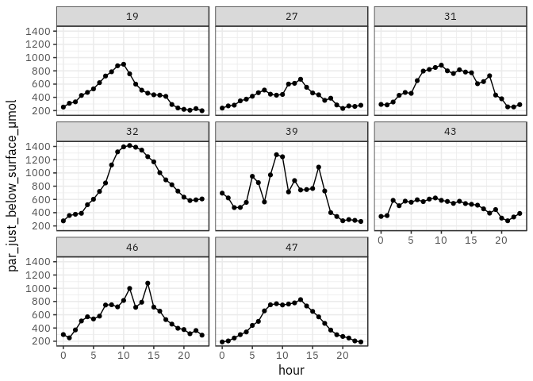
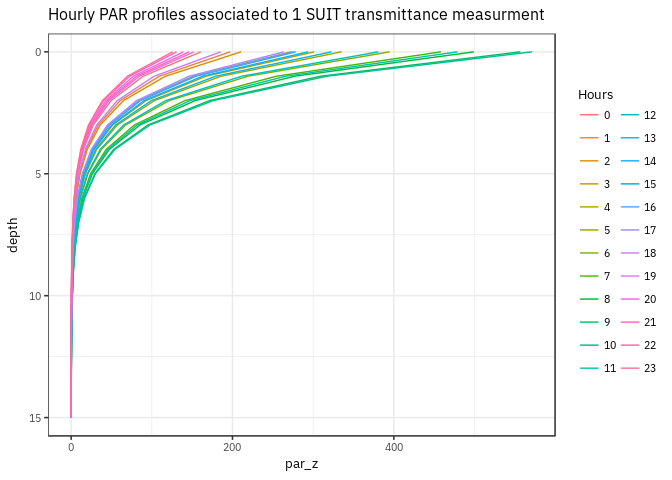

Transsiz
========

This simple report give an overview of the data and procedures used to
estimate daily primary production. Primary production was calculated
using PAR data from the pyranometer and light transmittance measured by:

1.  SUIT
2.  ROV

Pyranometer
-----------

This graphic shows hourly averaged pyranometer data.

ROV data
--------

-   Transmittance files used: `rovT_irrad`.
-   Observations with `pitch` and `roll` between -10 and 10 degrees were
    kept.
-   Ice thickness was estimated as: *ice\_thickness = depth\_water\_m -
    dist\_sea\_ice\_bottom\_m*
-   Using each transmittance measurement, PAR0- (measured by the
    pyranometer) was propagated in the water column.

SUIT data
---------

-   Transmittance files used: `Ir_Dist_draft01_b.dat`.
-   Depth of measurement (draft) was assumed to reflect the
    transmittance just below ice (i.e. transmittance\_ed0).
-   Only haul number was specified in transmittance files. Station id
    was matched with the file `Summary_file_PS92.txt`.
-   Lat/long were extracted in files like `Lat_lon_01.dat` where the
    last part of the file name reflects the haul number.
-   Using each transmittance measurement, PAR0- (measured by the
    pyranometer) was propagated in the water column.

Matching SUIT and ROV transmittance data
----------------------------------------

There was some ROV stations without matching SUIT measurements. After
discussions, we came up with this table that links stations together.

<table>
<thead>
<tr class="header">
<th>ROV</th>
<th>SUIT</th>
<th></th>
</tr>
</thead>
<tbody>
<tr class="odd">
<td>19</td>
<td>19</td>
<td></td>
</tr>
<tr class="even">
<td>27</td>
<td>27</td>
<td></td>
</tr>
<tr class="odd">
<td>31</td>
<td><strong>28</strong></td>
<td>No match, so use a different SUIT station</td>
</tr>
<tr class="even">
<td>32</td>
<td></td>
<td>We forget this station</td>
</tr>
<tr class="odd">
<td>39</td>
<td>39</td>
<td></td>
</tr>
<tr class="even">
<td>43</td>
<td>43</td>
<td></td>
</tr>
<tr class="odd">
<td>46</td>
<td><strong>45</strong></td>
<td>No match, so use a different SUIT station</td>
</tr>
<tr class="even">
<td>47</td>
<td>47</td>
<td></td>
</tr>
</tbody>
</table>

**For this study, we will use a total of seven stations 19, 27, 31, 39,
43, 46, 47.**

Kd
--

Kd were calculated using vertical profiles made by the ROV at each
station. Calculated Kd are used to propagate pyranomater light using
both ROV and SUIT transmittance data.

Propagating light in the water column
-------------------------------------

With both ROV and SUIT transmittance estimated just under the ice, PAR0-
was propagated in the water column using the flowing equation:

Where par\_just\_below\_surface\_umol is the irradiance measured by the
pyranomater at 0-.

Photosynthetic parameters (PvsE curves)
---------------------------------------

Photosynthetic parameters have been determined from the P vs E curves
obtained according to a method derived from Lewis and Smith (1983) both
on water samples taken from the rosette and ice core bottom (last cm,
see an example in Fig. ). Some samples were also collected directly
under the ice (UISW).

Two different models based on the original definition proposed by (Platt
et al., 1980) were used depending on the situation.

### Model with photoinhibition

When apparent photo-inhibition was present, a model including two
exponential was fitted (equation ).

### Model without photoinhibition

When no apparent photo-inhibition was present, a model including only
one exponential was fitted (equation ).

Finally, photosynthetic parameters have been interpolated between 0 and
15 m at 1 m increment.

Primary production
------------------

Daily primary production at each depth at each hour was calculated using
equation .

<table>
<caption>Number of primary production profiles generated by combining pyranometer and SUIT/ROV data.</caption>
<thead>
<tr class="header">
<th style="text-align: right;">station</th>
<th style="text-align: left;">data_source</th>
<th style="text-align: right;">n</th>
</tr>
</thead>
<tbody>
<tr class="odd">
<td style="text-align: right;">19</td>
<td style="text-align: left;">rov</td>
<td style="text-align: right;">1561</td>
</tr>
<tr class="even">
<td style="text-align: right;">19</td>
<td style="text-align: left;">suit</td>
<td style="text-align: right;">239</td>
</tr>
<tr class="odd">
<td style="text-align: right;">27</td>
<td style="text-align: left;">rov</td>
<td style="text-align: right;">1304</td>
</tr>
<tr class="even">
<td style="text-align: right;">27</td>
<td style="text-align: left;">suit</td>
<td style="text-align: right;">154</td>
</tr>
<tr class="odd">
<td style="text-align: right;">31</td>
<td style="text-align: left;">rov</td>
<td style="text-align: right;">1861</td>
</tr>
<tr class="even">
<td style="text-align: right;">31</td>
<td style="text-align: left;">suit</td>
<td style="text-align: right;">102</td>
</tr>
<tr class="odd">
<td style="text-align: right;">39</td>
<td style="text-align: left;">rov</td>
<td style="text-align: right;">242</td>
</tr>
<tr class="even">
<td style="text-align: right;">39</td>
<td style="text-align: left;">suit</td>
<td style="text-align: right;">110</td>
</tr>
<tr class="odd">
<td style="text-align: right;">43</td>
<td style="text-align: left;">rov</td>
<td style="text-align: right;">1137</td>
</tr>
<tr class="even">
<td style="text-align: right;">43</td>
<td style="text-align: left;">suit</td>
<td style="text-align: right;">167</td>
</tr>
<tr class="odd">
<td style="text-align: right;">46</td>
<td style="text-align: left;">rov</td>
<td style="text-align: right;">1959</td>
</tr>
<tr class="even">
<td style="text-align: right;">46</td>
<td style="text-align: left;">suit</td>
<td style="text-align: right;">107</td>
</tr>
<tr class="odd">
<td style="text-align: right;">47</td>
<td style="text-align: left;">rov</td>
<td style="text-align: right;">1147</td>
</tr>
<tr class="even">
<td style="text-align: right;">47</td>
<td style="text-align: left;">suit</td>
<td style="text-align: right;">154</td>
</tr>
</tbody>
</table>

The following graphs combine a total of 10244 estimations of primary
production.

<table>
<thead>
<tr class="header">
<th style="text-align: right;">station</th>
<th style="text-align: left;">data_source</th>
<th style="text-align: right;">mean_pp</th>
</tr>
</thead>
<tbody>
<tr class="odd">
<td style="text-align: right;">19</td>
<td style="text-align: left;">rov</td>
<td style="text-align: right;">6.7155797</td>
</tr>
<tr class="even">
<td style="text-align: right;">19</td>
<td style="text-align: left;">suit</td>
<td style="text-align: right;">199.5926978</td>
</tr>
<tr class="odd">
<td style="text-align: right;">27</td>
<td style="text-align: left;">rov</td>
<td style="text-align: right;">4.9282461</td>
</tr>
<tr class="even">
<td style="text-align: right;">27</td>
<td style="text-align: left;">suit</td>
<td style="text-align: right;">113.6763294</td>
</tr>
<tr class="odd">
<td style="text-align: right;">31</td>
<td style="text-align: left;">rov</td>
<td style="text-align: right;">7.0448588</td>
</tr>
<tr class="even">
<td style="text-align: right;">31</td>
<td style="text-align: left;">suit</td>
<td style="text-align: right;">11.2838315</td>
</tr>
<tr class="odd">
<td style="text-align: right;">39</td>
<td style="text-align: left;">rov</td>
<td style="text-align: right;">2.3364161</td>
</tr>
<tr class="even">
<td style="text-align: right;">39</td>
<td style="text-align: left;">suit</td>
<td style="text-align: right;">27.5449083</td>
</tr>
<tr class="odd">
<td style="text-align: right;">43</td>
<td style="text-align: left;">rov</td>
<td style="text-align: right;">0.9223309</td>
</tr>
<tr class="even">
<td style="text-align: right;">43</td>
<td style="text-align: left;">suit</td>
<td style="text-align: right;">21.7699775</td>
</tr>
<tr class="odd">
<td style="text-align: right;">46</td>
<td style="text-align: left;">rov</td>
<td style="text-align: right;">6.7880464</td>
</tr>
<tr class="even">
<td style="text-align: right;">46</td>
<td style="text-align: left;">suit</td>
<td style="text-align: right;">8.9546274</td>
</tr>
<tr class="odd">
<td style="text-align: right;">47</td>
<td style="text-align: left;">rov</td>
<td style="text-align: right;">115.0503088</td>
</tr>
<tr class="even">
<td style="text-align: right;">47</td>
<td style="text-align: left;">suit</td>
<td style="text-align: right;">219.3192967</td>
</tr>
</tbody>
</table>
