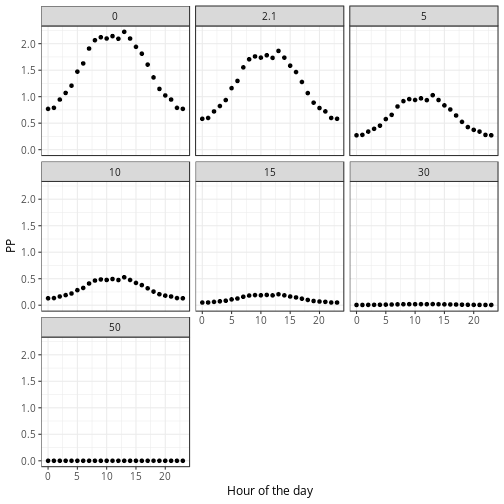

```r
# <><><><><><><><><><><><><><><><><><><><><><><><><><><><><><><><><><><><><><>  
# AUTHOR:       Philippe Massicotte
#
# DESCRIPTION:  Calculate PP based on P vs I curves.
# <><><><><><><><><><><><><><><><><><><><><><><><><><><><><><><><><><><><><><>
```

Last updated: 2016-11-29 08:44:03
## Open the PS file and do some cleaning


```r
ps <- readxl::read_excel("data/Global_PS_for_Takuvik.xlsx") %>% 
  janitor::clean_names() %>% 
  mutate(time = anytime::anytime(paste(date, format(time, "%H:%M:%S")))) %>% 
  mutate(time_numeric = as.numeric(time)) %>% 
  mutate(hour = as.numeric(format(time, "%H"))) %>% 
  mutate(par_just_below_ice_scalar_µmolquanta_corrected = par_just_below_ice_scalar_µmolquanta)
```

There is a problem with data later than 2015-06-20 20:20:00. Replace these "outliers" with the observations measured at the begining.


```r
i <- which(ps$time >= "2015-06-20 20:20:00")

ps$par_just_below_ice_scalar_µmolquanta_corrected[i] <- 
  ps$par_just_below_ice_scalar_µmolquanta_corrected[length(i):1]
```

## Plot the "raw" data
This is the raw data to work with.


```r
ps %>% 
  ggplot(aes(x = time, y = par_just_below_ice_scalar_µmolquanta)) +
  geom_point() +
  geom_point(aes(y = par_just_below_ice_scalar_µmolquanta_corrected), col = "red")
```


## Hourly PAR


```r
res <- ps %>% 
  group_by(hour) %>% 
  nest() %>% 
  mutate(e = map(data, ~pracma::trapz(1:6, .$par_just_below_ice_scalar_µmolquanta_corrected))) %>% 
  unnest(e)

res %>% 
  ggplot(aes(x = hour, y = e)) +
  geom_line() +
  geom_point()
```


## Calculate e at each depth
This is done based on the integrated surface PAR and a kd value of 0.15 $m^{-1}$.


```r
compute_ez <- function(e) {

  kd <- -0.15 #m-1

  depth <- c(0, 2.1, 5, 10, 15, 30, 50)
  e_z <- e * exp(kd * depth)
  
  df <- data_frame(
    depth = depth,
    e_z = e_z
  )
    
  return(df)
}

res <- res %>% 
  mutate(ez = map(.$e, compute_ez)) %>% 
  unnest(ez)

res %>% 
  ggplot(aes(x = e_z, y = depth, group = hour)) +
  geom_line() +
  scale_y_reverse()
```


## PI curve
In this section we start by calculating photosynthetic parameters of one PvsE curve.


```r
params <- readxl::read_excel("data/Calculs_PP_CTD47.xlsx") %>% 
  janitor::clean_names() %>% 
  rename(depth = depth_m) %>% 
  rename(tchl = tchl_a_mg_m3) %>% 
  rename(pmax = ps_mgc_m_3_h_1) %>% 
  rename(alpha = alpha_mgc_m_3_h_1_µmol_quanta_m_2_s_1_1) %>% 
  rename(beta = beta_b_mgc_3_h_1_µmol_quanta_m_2_s_1_1) 
```

## Calculate hourly PP at each depth


```r
dat <- inner_join(res, params, by = "depth") %>% 
  mutate(p = pmax * (1 - exp(-alpha * e_z / pmax)) * exp(-beta * e_z / pmax))

knitr::kable(dat)
```


| hour|         e| depth|         e_z|station    |  tchl|      pmax|     alpha|      beta|   kd|         p|
|----:|---------:|-----:|-----------:|:----------|-----:|---------:|---------:|---------:|----:|---------:|
|    0|  55.35692|   0.0|  55.3569220|PS92_47-04 | 3.292| 3.2274033| 0.0801157| 0.0009423| 0.15| 2.3720491|
|    0|  55.35692|   2.1|  40.3988658|PS92_47-04 | 3.292| 3.2274033| 0.0801157| 0.0009423| 0.15| 2.0195182|
|    0|  55.35692|   5.0|  26.1487584|PS92_47-04 | 2.690| 3.3128969| 0.0544792| 0.0012892| 0.15| 1.1461170|
|    0|  55.35692|  10.0|  12.3517989|PS92_47-04 | 2.932| 2.7518719| 0.0543782| 0.0543782| 0.15| 0.4669070|
|    0|  55.35692|  15.0|   5.8345767|PS92_47-04 | 1.885| 1.6443495| 0.0435910| 0.0003014| 0.15| 0.2353901|
|    0|  55.35692|  30.0|   0.6149599|PS92_47-04 | 1.681| 1.3911954| 0.0400912| 0.0004935| 0.15| 0.0244320|
|    0|  55.35692|  50.0|   0.0306170|PS92_47-04 | 0.177| 0.0957379| 0.0046264| 0.0000413| 0.15| 0.0001415|
|    1|  56.78937|   0.0|  56.7893692|PS92_47-04 | 3.292| 3.2274033| 0.0801157| 0.0009423| 0.15| 2.3991185|
|    1|  56.78937|   2.1|  41.4442499|PS92_47-04 | 3.292| 3.2274033| 0.0801157| 0.0009423| 0.15| 2.0488649|
|    1|  56.78937|   5.0|  26.8253986|PS92_47-04 | 2.690| 3.3128969| 0.0544792| 0.0012892| 0.15| 1.1694142|
|    1|  56.78937|  10.0|  12.6714211|PS92_47-04 | 2.932| 2.7518719| 0.0543782| 0.0543782| 0.15| 0.4745342|
|    1|  56.78937|  15.0|   5.9855555|PS92_47-04 | 1.885| 1.6443495| 0.0435910| 0.0003014| 0.15| 0.2410044|
|    1|  56.78937|  30.0|   0.6308729|PS92_47-04 | 1.681| 1.3911954| 0.0400912| 0.0004935| 0.15| 0.0250583|
|    1|  56.78937|  50.0|   0.0314093|PS92_47-04 | 0.177| 0.0957379| 0.0046264| 0.0000413| 0.15| 0.0001452|
|    2|  70.33316|   0.0|  70.3331575|PS92_47-04 | 3.292| 3.2274033| 0.0801157| 0.0009423| 0.15| 2.6101176|
|    2|  70.33316|   2.1|  51.3283559|PS92_47-04 | 3.292| 3.2274033| 0.0801157| 0.0009423| 0.15| 2.2902220|
|    2|  70.33316|   5.0|  33.2230312|PS92_47-04 | 2.690| 3.3128969| 0.0544792| 0.0012892| 0.15| 1.3765980|
|    2|  70.33316|  10.0|  15.6934487|PS92_47-04 | 2.932| 2.7518719| 0.0543782| 0.0543782| 0.15| 0.5381008|
|    2|  70.33316|  15.0|   7.4130603|PS92_47-04 | 1.885| 1.6443495| 0.0435910| 0.0003014| 0.15| 0.2929747|
|    2|  70.33316|  30.0|   0.7813308|PS92_47-04 | 1.681| 1.3911954| 0.0400912| 0.0004935| 0.15| 0.0309659|
|    2|  70.33316|  50.0|   0.0389002|PS92_47-04 | 0.177| 0.0957379| 0.0046264| 0.0000413| 0.15| 0.0001798|
|    3|  81.01921|   0.0|  81.0192136|PS92_47-04 | 3.292| 3.2274033| 0.0801157| 0.0009423| 0.15| 2.7301276|
|    3|  81.01921|   2.1|  59.1269207|PS92_47-04 | 3.292| 3.2274033| 0.0801157| 0.0009423| 0.15| 2.4411543|
|    3|  81.01921|   5.0|  38.2707666|PS92_47-04 | 2.690| 3.3128969| 0.0544792| 0.0012892| 0.15| 1.5244487|
|    3|  81.01921|  10.0|  18.0778301|PS92_47-04 | 2.932| 2.7518719| 0.0543782| 0.0543782| 0.15| 0.5783168|
|    3|  81.01921|  15.0|   8.5393623|PS92_47-04 | 1.885| 1.6443495| 0.0435910| 0.0003014| 0.15| 0.3325930|
|    3|  81.01921|  30.0|   0.9000422|PS92_47-04 | 1.681| 1.3911954| 0.0400912| 0.0004935| 0.15| 0.0356085|
|    3|  81.01921|  50.0|   0.0448105|PS92_47-04 | 0.177| 0.0957379| 0.0046264| 0.0000413| 0.15| 0.0002071|
|    4|  92.61487|   0.0|  92.6148737|PS92_47-04 | 3.292| 3.2274033| 0.0801157| 0.0009423| 0.15| 2.8260513|
|    4|  92.61487|   2.1|  67.5893044|PS92_47-04 | 3.292| 3.2274033| 0.0801157| 0.0009423| 0.15| 2.5732926|
|    4|  92.61487|   5.0|  43.7481686|PS92_47-04 | 2.690| 3.3128969| 0.0544792| 0.0012892| 0.15| 1.6707152|
|    4|  92.61487|  10.0|  20.6651716|PS92_47-04 | 2.932| 2.7518719| 0.0543782| 0.0543782| 0.15| 0.6132801|
|    4|  92.61487|  15.0|   9.7615359|PS92_47-04 | 1.885| 1.6443495| 0.0435910| 0.0003014| 0.15| 0.3742460|
|    4|  92.61487|  30.0|   1.0288583|PS92_47-04 | 1.681| 1.3911954| 0.0400912| 0.0004935| 0.15| 0.0406279|
|    4|  92.61487|  50.0|   0.0512238|PS92_47-04 | 0.177| 0.0957379| 0.0046264| 0.0000413| 0.15| 0.0002367|
|    5| 123.71330|   0.0| 123.7133024|PS92_47-04 | 3.292| 3.2274033| 0.0801157| 0.0009423| 0.15| 2.9685458|
|    5| 123.71330|   2.1|  90.2845917|PS92_47-04 | 3.292| 3.2274033| 0.0801157| 0.0009423| 0.15| 2.8091885|
|    5| 123.71330|   5.0|  58.4380262|PS92_47-04 | 2.690| 3.3128969| 0.0544792| 0.0012892| 0.15| 1.9996701|
|    5| 123.71330|  10.0|  27.6041690|PS92_47-04 | 2.932| 2.7518719| 0.0543782| 0.0543782| 0.15| 0.6705451|
|    5| 123.71330|  15.0|  13.0392861|PS92_47-04 | 1.885| 1.6443495| 0.0435910| 0.0003014| 0.15| 0.4794160|
|    5| 123.71330|  30.0|   1.3743306|PS92_47-04 | 1.681| 1.3911954| 0.0400912| 0.0004935| 0.15| 0.0539955|
|    5| 123.71330|  50.0|   0.0684239|PS92_47-04 | 0.177| 0.0957379| 0.0046264| 0.0000413| 0.15| 0.0003160|
|    6| 142.15606|   0.0| 142.1560601|PS92_47-04 | 3.292| 3.2274033| 0.0801157| 0.0009423| 0.15| 3.0053470|
|    6| 142.15606|   2.1| 103.7439111|PS92_47-04 | 3.292| 3.2274033| 0.0801157| 0.0009423| 0.15| 2.8927328|
|    6| 142.15606|   5.0|  67.1497681|PS92_47-04 | 2.690| 3.3128969| 0.0544792| 0.0012892| 0.15| 2.1576795|
|    6| 142.15606|  10.0|  31.7193045|PS92_47-04 | 2.932| 2.7518719| 0.0543782| 0.0543782| 0.15| 0.6847293|
|    6| 142.15606|  15.0|  14.9831385|PS92_47-04 | 1.885| 1.6443495| 0.0435910| 0.0003014| 0.15| 0.5375367|
|    6| 142.15606|  30.0|   1.5792112|PS92_47-04 | 1.681| 1.3911954| 0.0400912| 0.0004935| 0.15| 0.0618588|
|    6| 142.15606|  50.0|   0.0786243|PS92_47-04 | 0.177| 0.0957379| 0.0046264| 0.0000413| 0.15| 0.0003630|
|    7| 184.98623|   0.0| 184.9862314|PS92_47-04 | 3.292| 3.2274033| 0.0801157| 0.0009423| 0.15| 3.0267274|
|    7| 184.98623|   2.1| 135.0008936|PS92_47-04 | 3.292| 3.2274033| 0.0801157| 0.0009423| 0.15| 2.9939388|
|    7| 184.98623|   5.0|  87.3813084|PS92_47-04 | 2.690| 3.3128969| 0.0544792| 0.0012892| 0.15| 2.4411435|
|    7| 184.98623|  10.0|  41.2760074|PS92_47-04 | 2.932| 2.7518719| 0.0543782| 0.0543782| 0.15| 0.6788252|
|    7| 184.98623|  15.0|  19.4974053|PS92_47-04 | 1.885| 1.6443495| 0.0435910| 0.0003014| 0.15| 0.6613158|
|    7| 184.98623|  30.0|   2.0550114|PS92_47-04 | 1.681| 1.3911954| 0.0400912| 0.0004935| 0.15| 0.0799376|
|    7| 184.98623|  50.0|   0.1023130|PS92_47-04 | 0.177| 0.0957379| 0.0046264| 0.0000413| 0.15| 0.0004721|
|    8| 211.73718|   0.0| 211.7371829|PS92_47-04 | 3.292| 3.2274033| 0.0801157| 0.0009423| 0.15| 3.0180954|
|    8| 211.73718|   2.1| 154.5234403|PS92_47-04 | 3.292| 3.2274033| 0.0801157| 0.0009423| 0.15| 3.0184415|
|    8| 211.73718|   5.0| 100.0175632|PS92_47-04 | 2.690| 3.3128969| 0.0544792| 0.0012892| 0.15| 2.5712525|
|    8| 211.73718|  10.0|  47.2449515|PS92_47-04 | 2.932| 2.7518719| 0.0543782| 0.0543782| 0.15| 0.6565463|
|    8| 211.73718|  15.0|  22.3169349|PS92_47-04 | 1.885| 1.6443495| 0.0435910| 0.0003014| 0.15| 0.7313128|
|    8| 211.73718|  30.0|   2.3521876|PS92_47-04 | 1.681| 1.3911954| 0.0400912| 0.0004935| 0.15| 0.0911010|
|    8| 211.73718|  50.0|   0.1171085|PS92_47-04 | 0.177| 0.0957379| 0.0046264| 0.0000413| 0.15| 0.0005402|
|    9| 221.02660|   0.0| 221.0266030|PS92_47-04 | 3.292| 3.2274033| 0.0801157| 0.0009423| 0.15| 3.0131704|
|    9| 221.02660|   2.1| 161.3027558|PS92_47-04 | 3.292| 3.2274033| 0.0801157| 0.0009423| 0.15| 3.0227656|
|    9| 221.02660|   5.0| 104.4055745|PS92_47-04 | 2.690| 3.3128969| 0.0544792| 0.0012892| 0.15| 2.6096192|
|    9| 221.02660|  10.0|  49.3177013|PS92_47-04 | 2.932| 2.7518719| 0.0543782| 0.0543782| 0.15| 0.6465826|
|    9| 221.02660|  15.0|  23.2960326|PS92_47-04 | 1.885| 1.6443495| 0.0435910| 0.0003014| 0.15| 0.7543988|
|    9| 221.02660|  30.0|   2.4553838|PS92_47-04 | 1.681| 1.3911954| 0.0400912| 0.0004935| 0.15| 0.0949546|
|    9| 221.02660|  50.0|   0.1222464|PS92_47-04 | 0.177| 0.0957379| 0.0046264| 0.0000413| 0.15| 0.0005639|
|   10| 215.85547|   0.0| 215.8554686|PS92_47-04 | 3.292| 3.2274033| 0.0801157| 0.0009423| 0.15| 3.0160044|
|   10| 215.85547|   2.1| 157.5289194|PS92_47-04 | 3.292| 3.2274033| 0.0801157| 0.0009423| 0.15| 3.0205766|
|   10| 215.85547|   5.0| 101.9629036|PS92_47-04 | 2.690| 3.3128969| 0.0544792| 0.0012892| 0.15| 2.5886603|
|   10| 215.85547|  10.0|  48.1638653|PS92_47-04 | 2.932| 2.7518719| 0.0543782| 0.0543782| 0.15| 0.6522481|
|   10| 215.85547|  15.0|  22.7509990|PS92_47-04 | 1.885| 1.6443495| 0.0435910| 0.0003014| 0.15| 0.7416230|
|   10| 215.85547|  30.0|   2.3979377|PS92_47-04 | 1.681| 1.3911954| 0.0400912| 0.0004935| 0.15| 0.0928109|
|   10| 215.85547|  50.0|   0.1193863|PS92_47-04 | 0.177| 0.0957379| 0.0046264| 0.0000413| 0.15| 0.0005507|
|   11| 227.12167|   0.0| 227.1216658|PS92_47-04 | 3.292| 3.2274033| 0.0801157| 0.0009423| 0.15| 3.0095693|
|   11| 227.12167|   2.1| 165.7508648|PS92_47-04 | 3.292| 3.2274033| 0.0801157| 0.0009423| 0.15| 3.0247059|
|   11| 227.12167|   5.0| 107.2846783|PS92_47-04 | 2.690| 3.3128969| 0.0544792| 0.0012892| 0.15| 2.6330890|
|   11| 227.12167|  10.0|  50.6776937|PS92_47-04 | 2.932| 2.7518719| 0.0543782| 0.0543782| 0.15| 0.6395534|
|   11| 227.12167|  15.0|  23.9384475|PS92_47-04 | 1.885| 1.6443495| 0.0435910| 0.0003014| 0.15| 0.7692176|
|   11| 227.12167|  30.0|   2.5230938|PS92_47-04 | 1.681| 1.3911954| 0.0400912| 0.0004935| 0.15| 0.0974768|
|   11| 227.12167|  50.0|   0.1256174|PS92_47-04 | 0.177| 0.0957379| 0.0046264| 0.0000413| 0.15| 0.0005794|
|   12| 216.17061|   0.0| 216.1706070|PS92_47-04 | 3.292| 3.2274033| 0.0801157| 0.0009423| 0.15| 3.0158380|
|   12| 216.17061|   2.1| 157.7589039|PS92_47-04 | 3.292| 3.2274033| 0.0801157| 0.0009423| 0.15| 3.0207253|
|   12| 216.17061|   5.0| 102.1117644|PS92_47-04 | 2.690| 3.3128969| 0.0544792| 0.0012892| 0.15| 2.5899658|
|   12| 216.17061|  10.0|  48.2341821|PS92_47-04 | 2.932| 2.7518719| 0.0543782| 0.0543782| 0.15| 0.6519112|
|   12| 216.17061|  15.0|  22.7842143|PS92_47-04 | 1.885| 1.6443495| 0.0435910| 0.0003014| 0.15| 0.7424070|
|   12| 216.17061|  30.0|   2.4014385|PS92_47-04 | 1.681| 1.3911954| 0.0400912| 0.0004935| 0.15| 0.0929416|
|   12| 216.17061|  50.0|   0.1195606|PS92_47-04 | 0.177| 0.0957379| 0.0046264| 0.0000413| 0.15| 0.0005515|
|   13| 242.26263|   0.0| 242.2626327|PS92_47-04 | 3.292| 3.2274033| 0.0801157| 0.0009423| 0.15| 2.9996478|
|   13| 242.26263|   2.1| 176.8005740|PS92_47-04 | 3.292| 3.2274033| 0.0801157| 0.0009423| 0.15| 3.0269727|
|   13| 242.26263|   5.0| 114.4367647|PS92_47-04 | 2.690| 3.3128969| 0.0544792| 0.0012892| 0.15| 2.6860028|
|   13| 242.26263|  10.0|  54.0561000|PS92_47-04 | 2.932| 2.7518719| 0.0543782| 0.0543782| 0.15| 0.6206858|
|   13| 242.26263|  15.0|  25.5342936|PS92_47-04 | 1.885| 1.6443495| 0.0435910| 0.0003014| 0.15| 0.8049343|
|   13| 242.26263|  30.0|   2.6912947|PS92_47-04 | 1.681| 1.3911954| 0.0400912| 0.0004935| 0.15| 0.1037203|
|   13| 242.26263|  50.0|   0.1339917|PS92_47-04 | 0.177| 0.0957379| 0.0046264| 0.0000413| 0.15| 0.0006179|
|   14| 216.82237|   0.0| 216.8223704|PS92_47-04 | 3.292| 3.2274033| 0.0801157| 0.0009423| 0.15| 3.0154913|
|   14| 216.82237|   2.1| 158.2345536|PS92_47-04 | 3.292| 3.2274033| 0.0801157| 0.0009423| 0.15| 3.0210263|
|   14| 216.82237|   5.0| 102.4196357|PS92_47-04 | 2.690| 3.3128969| 0.0544792| 0.0012892| 0.15| 2.5926542|
|   14| 216.82237|  10.0|  48.3796102|PS92_47-04 | 2.932| 2.7518719| 0.0543782| 0.0543782| 0.15| 0.6512109|
|   14| 216.82237|  15.0|  22.8529097|PS92_47-04 | 1.885| 1.6443495| 0.0435910| 0.0003014| 0.15| 0.7440261|
|   14| 216.82237|  30.0|   2.4086790|PS92_47-04 | 1.681| 1.3911954| 0.0400912| 0.0004935| 0.15| 0.0932120|
|   14| 216.82237|  50.0|   0.1199211|PS92_47-04 | 0.177| 0.0957379| 0.0046264| 0.0000413| 0.15| 0.0005532|
|   15| 188.81803|   0.0| 188.8180277|PS92_47-04 | 3.292| 3.2274033| 0.0801157| 0.0009423| 0.15| 3.0261510|
|   15| 188.81803|   2.1| 137.7972959|PS92_47-04 | 3.292| 3.2274033| 0.0801157| 0.0009423| 0.15| 2.9987806|
|   15| 188.81803|   5.0|  89.1913208|PS92_47-04 | 2.690| 3.3128969| 0.0544792| 0.0012892| 0.15| 2.4617260|
|   15| 188.81803|  10.0|  42.1309968|PS92_47-04 | 2.932| 2.7518719| 0.0543782| 0.0543782| 0.15| 0.6763231|
|   15| 188.81803|  15.0|  19.9012737|PS92_47-04 | 1.885| 1.6443495| 0.0435910| 0.0003014| 0.15| 0.6716722|
|   15| 188.81803|  30.0|   2.0975788|PS92_47-04 | 1.681| 1.3911954| 0.0400912| 0.0004935| 0.15| 0.0815426|
|   15| 188.81803|  50.0|   0.1044323|PS92_47-04 | 0.177| 0.0957379| 0.0046264| 0.0000413| 0.15| 0.0004819|
|   16| 168.57039|   0.0| 168.5703865|PS92_47-04 | 3.292| 3.2274033| 0.0801157| 0.0009423| 0.15| 3.0256091|
|   16| 168.57039|   2.1| 123.0207926|PS92_47-04 | 3.292| 3.2274033| 0.0801157| 0.0009423| 0.15| 2.9666425|
|   16| 168.57039|   5.0|  79.6270124|PS92_47-04 | 2.690| 3.3128969| 0.0544792| 0.0012892| 0.15| 2.3447107|
|   16| 168.57039|  10.0|  37.6131373|PS92_47-04 | 2.932| 2.7518719| 0.0543782| 0.0543782| 0.15| 0.6863249|
|   16| 168.57039|  15.0|  17.7671880|PS92_47-04 | 1.885| 1.6443495| 0.0435910| 0.0003014| 0.15| 0.6156472|
|   16| 168.57039|  30.0|   1.8726478|PS92_47-04 | 1.681| 1.3911954| 0.0400912| 0.0004935| 0.15| 0.0730384|
|   16| 168.57039|  50.0|   0.0932336|PS92_47-04 | 0.177| 0.0957379| 0.0046264| 0.0000413| 0.15| 0.0004303|
|   17| 139.63495|   0.0| 139.6349531|PS92_47-04 | 3.292| 3.2274033| 0.0801157| 0.0009423| 0.15| 3.0016890|
|   17| 139.63495|   2.1| 101.9040352|PS92_47-04 | 3.292| 3.2274033| 0.0801157| 0.0009423| 0.15| 2.8831416|
|   17| 139.63495|   5.0|  65.9588814|PS92_47-04 | 2.690| 3.3128969| 0.0544792| 0.0012892| 0.15| 2.1375135|
|   17| 139.63495|  10.0|  31.1567694|PS92_47-04 | 2.932| 2.7518719| 0.0543782| 0.0543782| 0.15| 0.6835035|
|   17| 139.63495|  15.0|  14.7174158|PS92_47-04 | 1.885| 1.6443495| 0.0435910| 0.0003014| 0.15| 0.5297702|
|   17| 139.63495|  30.0|   1.5512042|PS92_47-04 | 1.681| 1.3911954| 0.0400912| 0.0004935| 0.15| 0.0607867|
|   17| 139.63495|  50.0|   0.0772299|PS92_47-04 | 0.177| 0.0957379| 0.0046264| 0.0000413| 0.15| 0.0003566|
|   18| 111.48020|   0.0| 111.4802033|PS92_47-04 | 3.292| 3.2274033| 0.0801157| 0.0009423| 0.15| 2.9277629|
|   18| 111.48020|   2.1|  81.3570121|PS92_47-04 | 3.292| 3.2274033| 0.0801157| 0.0009423| 0.15| 2.7333804|
|   18| 111.48020|   5.0|  52.6595194|PS92_47-04 | 2.690| 3.3128969| 0.0544792| 0.0012892| 0.15| 1.8804085|
|   18| 111.48020|  10.0|  24.8745956|PS92_47-04 | 2.932| 2.7518719| 0.0543782| 0.0543782| 0.15| 0.6536404|
|   18| 111.48020|  15.0|  11.7499270|PS92_47-04 | 1.885| 1.6443495| 0.0435910| 0.0003014| 0.15| 0.4391501|
|   18| 111.48020|  30.0|   1.2384332|PS92_47-04 | 1.681| 1.3911954| 0.0400912| 0.0004935| 0.15| 0.0487534|
|   18| 111.48020|  50.0|   0.0616580|PS92_47-04 | 0.177| 0.0957379| 0.0046264| 0.0000413| 0.15| 0.0002848|
|   19|  88.67564|   0.0|  88.6756439|PS92_47-04 | 3.292| 3.2274033| 0.0801157| 0.0009423| 0.15| 2.7968821|
|   19|  88.67564|   2.1|  64.7144983|PS92_47-04 | 3.292| 3.2274033| 0.0801157| 0.0009423| 0.15| 2.5316967|
|   19|  88.67564|   5.0|  41.8874082|PS92_47-04 | 2.690| 3.3128969| 0.0544792| 0.0012892| 0.15| 1.6226009|
|   19|  88.67564|  10.0|  19.7862106|PS92_47-04 | 2.932| 2.7518719| 0.0543782| 0.0543782| 0.15| 0.6023468|
|   19|  88.67564|  15.0|   9.3463441|PS92_47-04 | 1.885| 1.6443495| 0.0435910| 0.0003014| 0.15| 0.3602493|
|   19|  88.67564|  30.0|   0.9850974|PS92_47-04 | 1.681| 1.3911954| 0.0400912| 0.0004935| 0.15| 0.0389249|
|   19|  88.67564|  50.0|   0.0490451|PS92_47-04 | 0.177| 0.0957379| 0.0046264| 0.0000413| 0.15| 0.0002266|
|   20|  77.35931|   0.0|  77.3593110|PS92_47-04 | 3.292| 3.2274033| 0.0801157| 0.0009423| 0.15| 2.6928853|
|   20|  77.35931|   2.1|  56.4559645|PS92_47-04 | 3.292| 3.2274033| 0.0801157| 0.0009423| 0.15| 2.3929089|
|   20|  77.35931|   5.0|  36.5419511|PS92_47-04 | 2.690| 3.3128969| 0.0544792| 0.0012892| 0.15| 1.4752786|
|   20|  77.35931|  10.0|  17.2611955|PS92_47-04 | 2.932| 2.7518719| 0.0543782| 0.0543782| 0.15| 0.5654566|
|   20|  77.35931|  15.0|   8.1536114|PS92_47-04 | 1.885| 1.6443495| 0.0435910| 0.0003014| 0.15| 0.3191590|
|   20|  77.35931|  30.0|   0.8593843|PS92_47-04 | 1.681| 1.3911954| 0.0400912| 0.0004935| 0.15| 0.0340203|
|   20|  77.35931|  50.0|   0.0427862|PS92_47-04 | 0.177| 0.0957379| 0.0046264| 0.0000413| 0.15| 0.0001977|
|   21|  70.33316|   0.0|  70.3331575|PS92_47-04 | 3.292| 3.2274033| 0.0801157| 0.0009423| 0.15| 2.6101176|
|   21|  70.33316|   2.1|  51.3283559|PS92_47-04 | 3.292| 3.2274033| 0.0801157| 0.0009423| 0.15| 2.2902220|
|   21|  70.33316|   5.0|  33.2230312|PS92_47-04 | 2.690| 3.3128969| 0.0544792| 0.0012892| 0.15| 1.3765980|
|   21|  70.33316|  10.0|  15.6934487|PS92_47-04 | 2.932| 2.7518719| 0.0543782| 0.0543782| 0.15| 0.5381008|
|   21|  70.33316|  15.0|   7.4130603|PS92_47-04 | 1.885| 1.6443495| 0.0435910| 0.0003014| 0.15| 0.2929747|
|   21|  70.33316|  30.0|   0.7813308|PS92_47-04 | 1.681| 1.3911954| 0.0400912| 0.0004935| 0.15| 0.0309659|
|   21|  70.33316|  50.0|   0.0389002|PS92_47-04 | 0.177| 0.0957379| 0.0046264| 0.0000413| 0.15| 0.0001798|
|   22|  56.78937|   0.0|  56.7893692|PS92_47-04 | 3.292| 3.2274033| 0.0801157| 0.0009423| 0.15| 2.3991185|
|   22|  56.78937|   2.1|  41.4442499|PS92_47-04 | 3.292| 3.2274033| 0.0801157| 0.0009423| 0.15| 2.0488649|
|   22|  56.78937|   5.0|  26.8253986|PS92_47-04 | 2.690| 3.3128969| 0.0544792| 0.0012892| 0.15| 1.1694142|
|   22|  56.78937|  10.0|  12.6714211|PS92_47-04 | 2.932| 2.7518719| 0.0543782| 0.0543782| 0.15| 0.4745342|
|   22|  56.78937|  15.0|   5.9855555|PS92_47-04 | 1.885| 1.6443495| 0.0435910| 0.0003014| 0.15| 0.2410044|
|   22|  56.78937|  30.0|   0.6308729|PS92_47-04 | 1.681| 1.3911954| 0.0400912| 0.0004935| 0.15| 0.0250583|
|   22|  56.78937|  50.0|   0.0314093|PS92_47-04 | 0.177| 0.0957379| 0.0046264| 0.0000413| 0.15| 0.0001452|
|   23|  55.35692|   0.0|  55.3569220|PS92_47-04 | 3.292| 3.2274033| 0.0801157| 0.0009423| 0.15| 2.3720491|
|   23|  55.35692|   2.1|  40.3988658|PS92_47-04 | 3.292| 3.2274033| 0.0801157| 0.0009423| 0.15| 2.0195182|
|   23|  55.35692|   5.0|  26.1487584|PS92_47-04 | 2.690| 3.3128969| 0.0544792| 0.0012892| 0.15| 1.1461170|
|   23|  55.35692|  10.0|  12.3517989|PS92_47-04 | 2.932| 2.7518719| 0.0543782| 0.0543782| 0.15| 0.4669070|
|   23|  55.35692|  15.0|   5.8345767|PS92_47-04 | 1.885| 1.6443495| 0.0435910| 0.0003014| 0.15| 0.2353901|
|   23|  55.35692|  30.0|   0.6149599|PS92_47-04 | 1.681| 1.3911954| 0.0400912| 0.0004935| 0.15| 0.0244320|
|   23|  55.35692|  50.0|   0.0306170|PS92_47-04 | 0.177| 0.0957379| 0.0046264| 0.0000413| 0.15| 0.0001415|

```r
dat %>%
  ggplot(aes(x = hour, y = p)) +
  geom_point() +
  facet_wrap(~depth) +
  xlab("Hour of the day") + 
  ylab("PP")
```



## Calculate integrated PP at each depth
Calculating the sum of PP at each depth gives us the daily PP at each particular depth.


```r
res <- dat %>%
  group_by(depth) %>% 
  summarise(sum_day = sum(p))

res %>% 
  ggplot(aes(x = sum_day, y = depth)) +
  geom_point() +
  geom_line() +
  scale_y_reverse()
```


## Calculate the integrated PP
This is the integrated value of PP for 1 day. This is done by calculating the area under the curve of the daily PP at each depth.


```r
pracma::trapz(res$depth, res$sum_day)
```

```
## [1] 638.1606
```

