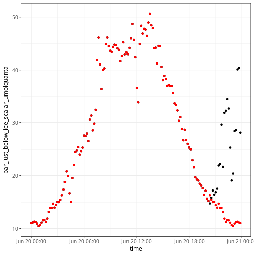
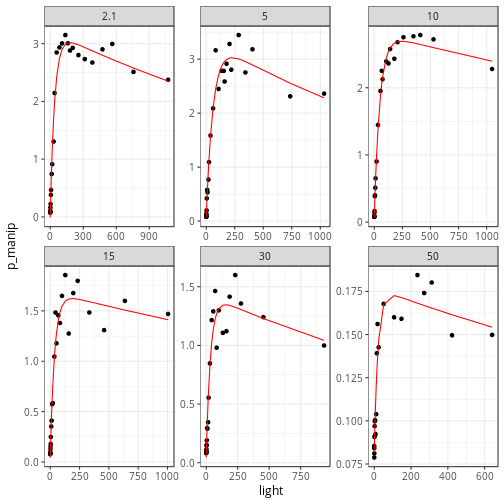

```r
# <><><><><><><><><><><><><><><><><><><><><><><><><><><><><><><><><><><><><><>  
# AUTHOR:       Philippe Massicotte
#
# DESCRIPTION:  Calculate PP based on P vs I curves.
# <><><><><><><><><><><><><><><><><><><><><><><><><><><><><><><><><><><><><><>
```

Last updated: 2016-11-29 14:05:18
## Open the PS file and do some cleaning


```r
ps <- readxl::read_excel("data/Global_PS_for_Takuvik.xlsx") %>% 
  janitor::clean_names() %>% 
  mutate(time = anytime::anytime(paste(date, format(time, "%H:%M:%S")))) %>% 
  mutate(time_numeric = as.numeric(time)) %>% 
  mutate(hour = as.numeric(format(time, "%H"))) %>% 
  mutate(par_just_below_ice_scalar_µmolquanta_corrected = par_just_below_ice_scalar_µmolquanta)
```

There is a problem with data later than 2015-06-20 20:20:00. Replace these "outliers" with the observations measured at the begining.


```r
i <- which(ps$time >= "2015-06-20 20:20:00")

ps$par_just_below_ice_scalar_µmolquanta_corrected[i] <- 
  ps$par_just_below_ice_scalar_µmolquanta_corrected[length(i):1]
```

## Plot the "raw" data
This is the raw data to work with.


```r
ps %>% 
  ggplot(aes(x = time, y = par_just_below_ice_scalar_µmolquanta)) +
  geom_point() +
  geom_point(aes(y = par_just_below_ice_scalar_µmolquanta_corrected), col = "red")
```



## Hourly PAR


```r
res <- ps %>% 
  group_by(hour) %>% 
  nest() %>% 
  mutate(e = map(data, ~pracma::trapz(1:6, .$par_just_below_ice_scalar_µmolquanta_corrected))) %>% 
  unnest(e)

res %>% 
  ggplot(aes(x = hour, y = e)) +
  geom_line() +
  geom_point()
```


## Calculate e at each depth
This is done based on the integrated surface PAR and a kd value of 0.15 $m^{-1}$.


```r
compute_ez <- function(e) {

  kd <- -0.15 #m-1

  depth <- c(0, 2.1, 5, 10, 15, 30, 50)
  e_z <- e * exp(kd * depth)
  
  df <- data_frame(
    depth = depth,
    e_z = e_z
  )
    
  return(df)
}

res <- res %>% 
  mutate(ez = map(.$e, compute_ez)) %>% 
  unnest(ez)

res %>% 
  ggplot(aes(x = e_z, y = depth, group = hour)) +
  geom_line() +
  scale_y_reverse()
```


## PI curve
In this section we start by calculating photosynthetic parameters of one P vs E curve.


```r
# Open de PE data
df <- read_csv("data/pe.csv") %>% 
  fill(depth)
```

```
## Parsed with column specification:
## cols(
##   depth = col_double(),
##   light = col_double(),
##   p_manip = col_double()
## )
```

```r
# Fit the PE curve for each depth
mod <- df %>%
  group_by(depth) %>%
  nest() %>%
  mutate(model = map(
    data,
    ~ minpack.lm::nlsLM(
      p_manip ~
        ps * (1 - exp(-alpha * light / ps)) * exp(-beta * light / ps) + p0,
      data = .,
      start = list(
        ps = 0.5,
        alpha = 0.005,
        beta = 0.004,
        p0 = 0
      ),
      lower = c(0, 0, 0, -Inf)
    )
  )) %>% 
  mutate(fitted = map(model, broom::augment)) %>% 
  mutate(coef = map(model, broom::tidy)) 

# Overview of the PE curves
mod %>% 
  unnest(fitted) %>% 
  ggplot(aes(x = light, y = p_manip)) +
  geom_point() +
  geom_line(aes(y = .fitted), col = "red") +
  facet_wrap(~depth, scales = "free")
```



## Calculate hourly PP at each depth


```r
params <- mod %>% 
  unnest(coef) %>% 
  select(depth, term, estimate) %>% 
  spread(term, estimate)

params <- rbind(params[1, ], params)
params$depth[1] <- 0

dat <- inner_join(res, params, by = "depth") %>% 
  mutate(p = ps * (1 - exp(-alpha * e_z / ps)) * exp(-beta * e_z / ps))

dat %>%
  ggplot(aes(x = hour, y = p)) +
  geom_point() +
  facet_wrap(~depth) +
  xlab("Hour of the day") + 
  ylab("PP")
```


## Calculate integrated PP at each depth
Calculating the sum of PP at each depth gives us the daily PP at each particular depth.


```r
res <- dat %>%
  group_by(depth) %>% 
  summarise(sum_day = sum(p))

res %>% 
  ggplot(aes(x = sum_day, y = depth)) +
  geom_point() +
  geom_line() +
  scale_y_reverse()
```


## Calculate the integrated PP
This is the integrated value of PP for 1 day. This is done by calculating the area under the curve of the daily PP at each depth.


```r
pracma::trapz(res$depth, res$sum_day)
```

```
## [1] 707.5934
```

